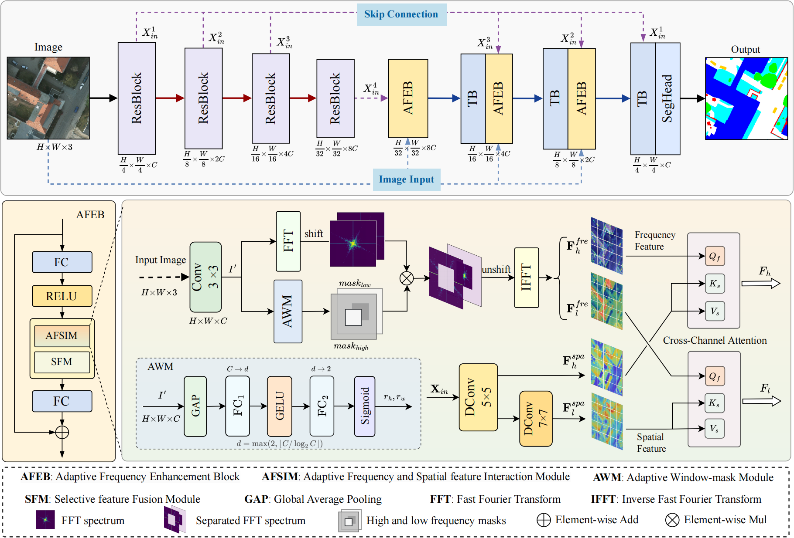

# 🚀 AFENet: Adaptive Frequency Enhancement Network for Remote Sensing Image Semantic Segmentation 

# (submitted to IEEE TGRS)

---

## 📌 **Introduction**

This repository contains the official implementation of our paper:  
📄 *Adaptive Frequency Enhancement Network for Remote Sensing Image Semantic Segmentation* 

**AFENet** is an advanced **semantic segmentation network** specifically designed for **high-resolution remote sensing image segmentation**. By integrating **spatial and frequency domain features**, AFENet dynamically adapts network parameters to various land cover types while enhancing the interaction between spatial and frequency features, achieving **high-precision segmentation results and strong generalizability**.


<div align=center>
 
</div>


### 🔍 **Key Features**

🔍 **Key Features:**  
✅ Adaptive Frequency and Spatial Interaction  
✅ Dynamic Feature Modulation for Diverse Land Covers  
✅ Enhanced Contextual and Detail Representation  
✅ Superior Segmentation Accuracy and Generalizability

---

## 📂 **Dataset**  

The dataset used in our experiments can be accessed from the following link:  

📥 **[Download Dataset ]([Benchmark on Semantic Labeling](https://www.isprs.org/education/benchmarks/UrbanSemLab/default.aspx))**  

---

## 🛠 **Installation & Dependencies**

Before running the code, make sure you have the following dependencies installed:

```bash
conda create -n airs python=3.8
conda activate airs
pip3 install torch torchvision torchaudio --index-url https://download.pytorch.org/whl/cu118
pip install -r requirements.txt
```

---

## 🏋️‍♂️ **Usage: Training AFENet**

To train **AFENet** on the **Vaihingen/Potsdam** dataset, use the following command:

```bash
python train.py -c config/vaihingen/afenet.py --max_epoch 100 --lr 6e-4 --batch_size 8
```

### 🔧 **Training Arguments**:

- `--epoch`: Number of training epochs
- `--lr`: Learning rate
- `--batchsize`: Batch size

---

## 📬 **Contact**

🔥 We hope AFFNet is helpful for your work. Thanks a lot for your attention.🔥

If you have any questions, feel free to contact us via Email:  
📧 [gaofeng@ouc.edu.cn](mailto:gaofeng@ouc.edu.cn)  
📧 [fumiao@stu.ouc.edu.cn](mailto:fumiao@stu.ouc.edu.cn)  


