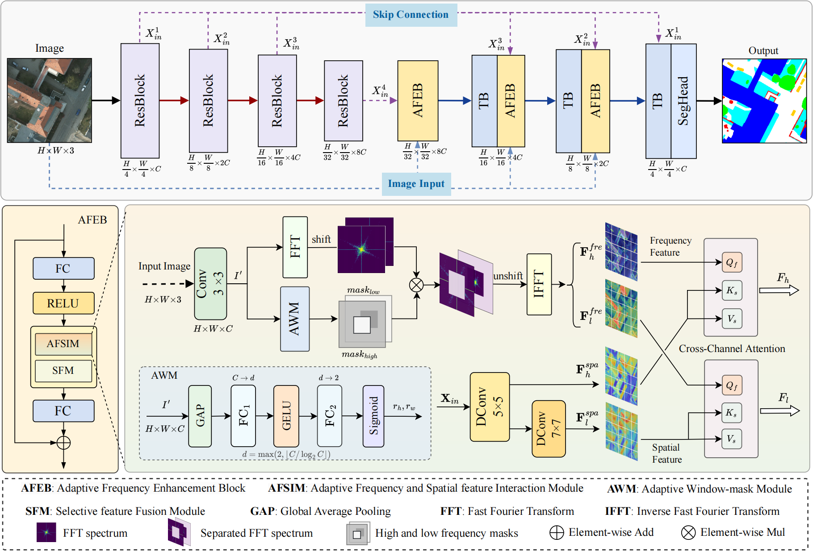

# 🚀 AFENet: Adaptive Frequency Enhancement Network for Remote Sensing Image Semantic Segmentation, IEEE TGRS 2025

<p align="center">
  🖐😭🤚 🌟 If this work is useful to you, please give this repository a Star! 🌟 🖐😭🤚
</p>

<p align="center">
<a href="https://arxiv.org/abs/2504.02647">
  
</a>
<a href="https://ieeexplore.ieee.org/document/10955240">
  
</a>
</p>


<div align=center>
 
</div>

---

## 📌 **Introduction**

This repository contains the official implementation of our paper:  
📄 *Adaptive Frequency Enhancement Network for Remote Sensing Image Semantic Segmentation, IEEE TGRS 2025*

Feng Gao, Miao Fu, Jingchao Cao, Junyu Dong, Qian Du

**AFENet** is an advanced **semantic segmentation network** specifically designed for **high-resolution remote sensing image segmentation**. By integrating **spatial and frequency domain features**, AFENet dynamically adapts network parameters to various land cover types while enhancing the interaction between spatial and frequency features, achieving **high-precision segmentation results and strong generalizability**.


### 🔍 **Key Features**

🔍 **Key Features:**  
✅ Adaptive Frequency and Spatial Interaction  
✅ Dynamic Feature Modulation for Diverse Land Covers  
✅ Enhanced Contextual and Detail Representation  
✅ Superior Segmentation Accuracy and Generalizability

---

## 📂 **Dataset**  

The dataset used in our experiments can be accessed from the following link:  

📥 **[Download Dataset ]([Benchmark on Semantic Labeling (The official link is invalid).](https://www.isprs.org/education/benchmarks/UrbanSemLab/default.aspx))**  

---

## 🛠 **Installation & Dependencies**

Before running the code, make sure you have the following dependencies installed:

```bash
conda create -n airs python=3.8
conda activate airs
pip3 install torch torchvision torchaudio --index-url https://download.pytorch.org/whl/cu118
pip install -r requirements.txt
```

---

## Data Preprocessing

After download the datasets, you still need split them yourself!
There are some scripts:

Generate the training set.

```bash
python GeoSeg/tools/DATASET_patch_split.py \
--img-dir "Your/Image/Path" \
--mask-dir "Your/Mask/Path" \
--output-img-dir "Your/OutPut/Path" \
--output-mask-dir "Your/OutPut/Path" \
--mode "train" --split-size 1024 --stride 512
```
tips: stride has different values, vaihingen is 512, while potsdam is 1024.

Generate the testing set.

```bash
python GeoSeg/tools/DATASET_patch_split.py \
--img-dir "data/vaihingen/test_images" \
--mask-dir "data/vaihingen/test_masks_eroded" \
--output-img-dir "data/vaihingen/test/images_1024" \
--output-mask-dir "data/vaihingen/test/masks_1024" \
--mode "val" --split-size 1024 --stride 1024 \
--eroded
```

Generate the masks_1024_rgb (RGB format ground truth labels) for visualization.

```bash
python GeoSeg/tools/DATASET_patch_split.py \
--img-dir "data/vaihingen/test_images" \
--mask-dir "data/vaihingen/test_masks_eroded" \
--output-img-dir "data/vaihingen/test/images_1024" \
--output-mask-dir "data/vaihingen/test/masks_1024" \
--mode "val" --split-size 1024 --stride 1024 \
--gt
```

## 🏋️‍♂️ **Usage: Training AFENet**

To train **AFENet** on the **Vaihingen/Potsdam** dataset, use the following command:

```bash
python train.py -c config/vaihingen/afenet.py --max_epoch 100 --lr 6e-4 --batch_size 8
```

### 🔧 **Training Arguments**:

- `--epoch`: Number of training epochs
- `--lr`: Learning rate
- `--batch_size`: Batch size

---
##  **Usage: Testing AFENet**

```bash
python DATASET_test.py -c config/DATASET/afenet.py -o Your/Output/Path --rgb
```

## 📬 **Contact**

🔥 We hope AFFNet is helpful for your work. Thanks a lot for your attention.🔥

If you have any questions, feel free to contact us via Email:  
📧 [gaofeng@ouc.edu.cn](mailto:gaofeng@ouc.edu.cn)  
📧 [fumiao@stu.ouc.edu.cn](mailto:fumiao@stu.ouc.edu.cn)  


